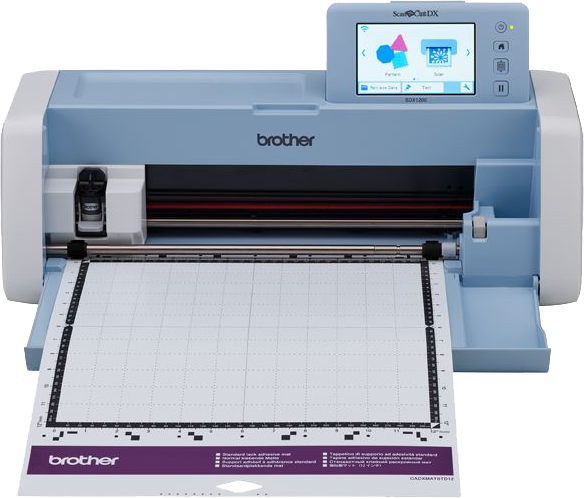

## Draft - WIP

Some time ago, I wanted to get into some crafting and manual work, so I acquired a cutting plotter: a ScanNCut SDX1200:

It's a very good machine, capable of cutting a wide variety of materials.
Lately, I've been exploring the world of pen plotting, and it turns out the SDX1200, with the right adapter, is a very capable pen plotter too!

[[image of some plots]].

However....

WIP!
