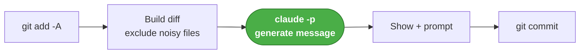
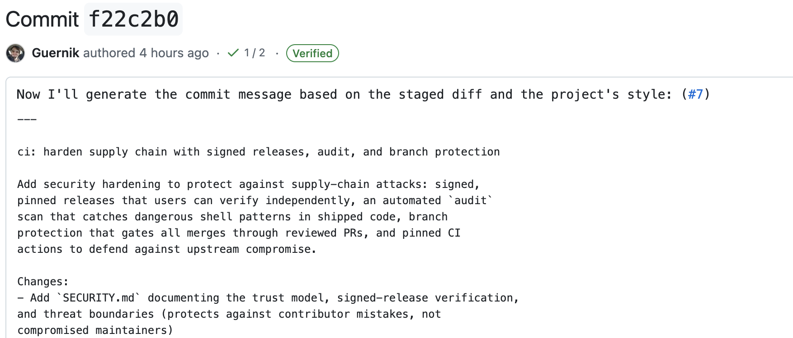
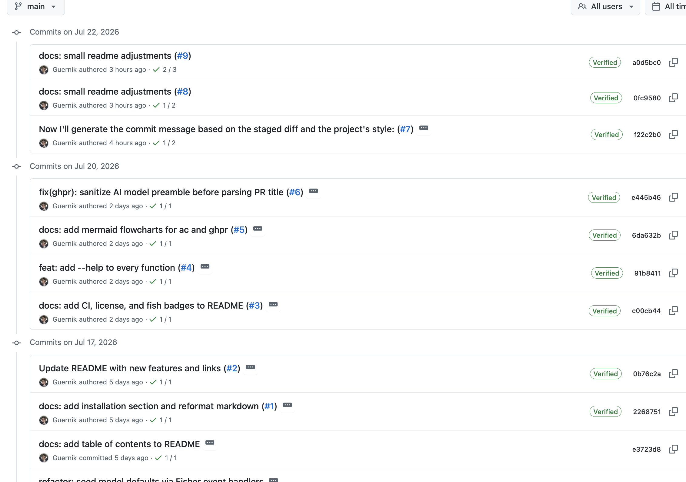
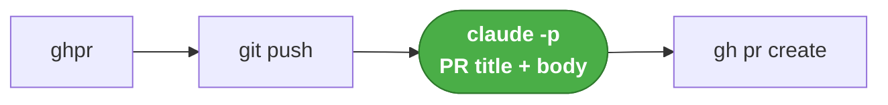
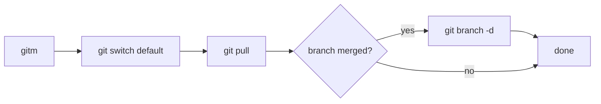

import Link from "@components/mdx/Link.astro"

Sometimes, when I'm doing edits directly, (i.e: without some agent, _—yes, I do write code myself sometimes—_ ), I still want a LLM-generated, [conventional-commit](https://www.conventionalcommits.org/en/v1.0.0/) message.

That's usually a single message to Claude "give me a conventional commit message for this diff", which I have later converted to a skill. This allows me to tune some nuances around when to use `chore` vs `build`, etc.,

However, even the use of the skill became a bit tedious, so I wrote a small set of `git` functions for the fish shell that I use daily.

These are `ac`, `ghpr` and `gitm`.

I have them released as a `fisher`<Link href="https://github.com/jorgebucaran/fisher" /> plugin, check out the [repo](https://github.com/Guernik/fish-ai-git)!

Once you have fisher installed, adding the functions is as easy as doing

```bash
fisher install Guernik/fish-ai-git@v1.0.0
```

Make sure to use the v1.0.0 since that's the signed [release](https://github.com/Guernik/fish-ai-git/releases).

## Project setup and repo hygiene

I like setting up my projects with good industry standard practices.  
In this case we have:

### 1. pre-commit hooks <Link href="https://github.com/Guernik/fish-ai-git/blob/main/.pre-commit-config.yaml" />

- `end-of-file-fixer`
- `trailing-whitespace`
- `check-merge-conflict`
- And the local checks: `fish-lint`, `fish-audit`, and `fish-test`

### 2. Unit tests

Thanks to [fishtape](https://github.com/jorgebucaran/fishtape), (available as a fisher plugin), we have some decent coverage:

```bash
emilio@Emilios-MacBook-Pro ~/p/fish_functions (main)> just test
TAP version 13
ok 1 ac bails when there is nothing to commit
ok 2 ac reports nothing to commit
ok 3 ac commits with the model's message subject
ok 4 ac sends the real source change to the model
ok 5 ac excludes lockfile content from the model prompt
...
ok 46 gitm -h prints usage

1..46
# pass 46
# ok
```

### 3. CI/CD

`lint-and-test` and `audit` checks are provided on the ci.yml [workflow file](https://github.com/Guernik/fish-ai-git/blob/main/.github/workflows/ci.yml)

The release is handled by the [release.yml](https://github.com/Guernik/fish-ai-git/blob/main/.github/workflows/release.yml) workflow, activated upon a newly pushed tag.  
The job will check that the tag was signed and generates a new GitHub release (look at the v1.0.0 release for an [example](https://github.com/Guernik/fish-ai-git/actions/runs/29933504901) job run)

## Functions logic

### `ac` (for AutoCommit)

#### How it works



#### Example

Help text:

```bash
emilio@emilio ~/ (main)> ac  --help
usage: ac [-h|--help]

Stage all changes (git add -A) and commit with an AI-generated
Conventional Commit message. Shows the message and prompts before
committing: [Y] commit, [e] edit in $EDITOR, [n] abort (changes
stay staged).

The model defaults to $AC_MODEL (haiku). Noisy/generated files
(lockfiles, minified assets, dist/, build/, snapshots) are hidden
from the diff sent to the model, but every staged file is committed.
```

Usage example:

```bash
emilio@emilio ~/p/fish_functions (docs/mermaid-diagrams)> ac
Generating commit message…

docs: reorganize README sections and add mermaid flow diagrams

Restructured the README to improve clarity and readability by moving the
Requirements section before Functions and relocating the `ac` and `ghpr` flow
diagrams into a dedicated Functions subsection.

Changes:
- Add Requirements section with dependencies: fish ≥ 3.6, claude, gh, and git
- Move Requirements section before the Functions section
- Create `ac` flow and `ghpr` flow subsections with mermaid diagrams
- Relocate flow diagrams from "How `ac` and `ghpr` work" section into function
subsections
- Remove "How `ac` and `ghpr` work" heading (content now integrated into
function flow subsections)

Commit? [Y/n/e(dit)]
```

It's not perfect though! For instance, look at this [commit](https://github.com/Guernik/fish-ai-git/commit/f22c2b030d3e857d514960606528d7eb4a67751a)

Some LLM related context got to the commit message. (Commit title should have been `ci: harden supply chain with signed releases...`)
In my defense, I did set up the `e(dit)` positivity to always have the last word, but this one slipped away!
(It does look ugly, but I will not rewrite the history of the repo for a small commit message mistake).

The rest of the commits are good though


### `ghpr` (for GitHub Pull Request)

`ghpr` pushes the current branch and opens a GitHub PR with an AI-generated title and body. It detects the base branch automatically, so most of the time it's a single command.

#### How it works



#### Example

```bash
emilio@Emilios-MacBook-Pro ~/p/fish_functions (docs/mermaid-diagrams)> ghpr
# → pushes the branch and opens a PR with an AI title + body
Push 'docs/mermaid-diagrams' and open PR against 'main'? [Y/n/w(eb)]
```

Same idea as `ac`: accept (`Y`), reject (`n`), or hit `w` to open the browser with the PR pre-filled instead of creating it directly.

### `gitm` (for Git Merge cleanup)

`gitm` is the tidy-up step after a PR gets merged. It switches to the repo's default branch, pulls, and deletes the branch you just left — but only if it's already merged, so unmerged work is never dropped.

#### How it works



#### Example

```bash
emilio@Emilios-MacBook-Pro ~/p/fish_functions (docs/mermaid-diagrams)> gitm
# → back on main, pulled, and the merged feature branch cleaned up
```

Together, `ac`, `ghpr` and `gitm` cover the whole loop — commit, open the PR, and clean up once it's merged — without ever leaving the terminal or hand-writing a message.
