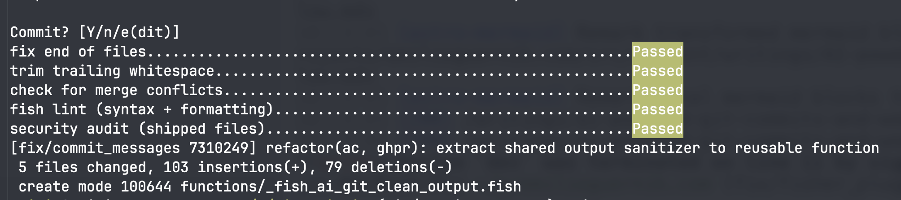
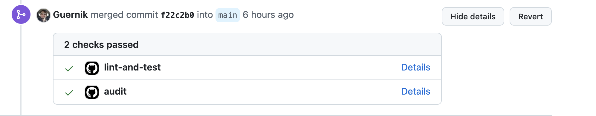
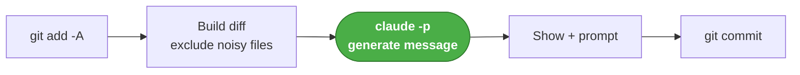
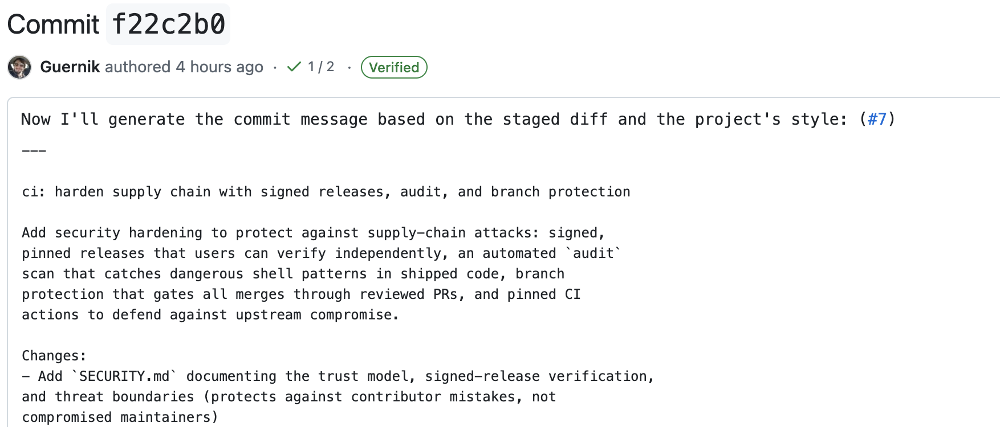
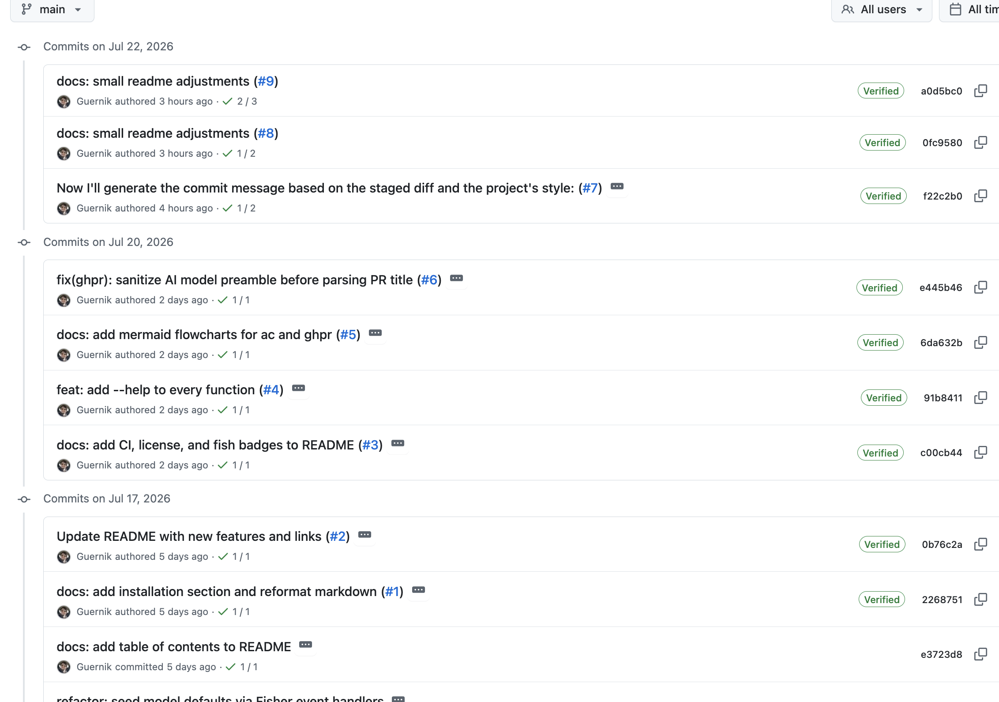
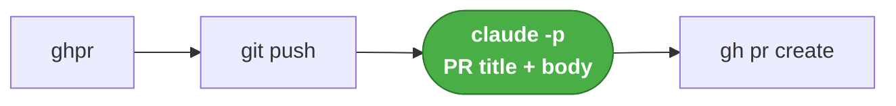
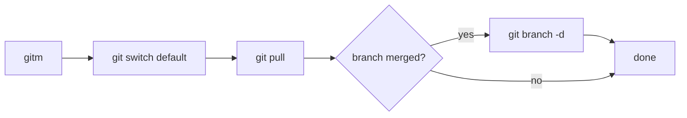

import Callout from "@components/mdx/Callout.astro"
import Link from "@components/mdx/Link.astro"

Do you remember when we used to write code _by hand_? I mean, like actually typing the code yourself.  
I know I will tell that story to my kid sometime in the future and he will not buy it. But anyway, I still write code, sometimes, and when I do, I still want an LLM-generated [conventional-commit](https://www.conventionalcommits.org/en/v1.0.0/) message.

That's usually a single message to Claude "give me a conventional commit message for this diff", which I have later converted to a skill. This allows me to tune some nuances around when to use `chore` vs `build`, etc.,

However, even the use of the skill became a bit tedious, so I wrote a small set of `fish` functions for git that I use daily.

These are `ac`, `ghpr` and `gitm`.

I have them released as a `fisher`<Link href="https://github.com/Guernik/fish-ai-git" /> plugin, check out the repo!

Once you have fisher installed, adding the functions is as easy as doing

```bash
fisher install Guernik/fish-ai-git@<check latest tag below>
```

I recommend pinning the the version tag, since that's the signed [release](https://github.com/Guernik/fish-ai-git/releases).  
Latest version is [](https://github.com/Guernik/fish-ai-git/releases/latest)

However, you will have to manually uninstall and install a new version for each release.  
If you want to update with a single command, you need to install from HEAD:

```bash
fisher install Guernik/fish-ai-git
```

Then for the update:

```bash
fisher update Guernik/fish-ai-git
```

## What they do?

`ac`: **stage all your changes, send a diff to the llm, and receive a conventional commit message.**

`ghpr`: **send a PR with your changes and set relevant title and description.**

`gitm`: **no LLM involved, just checkout main, pull your merged PR, and delete the merged branch.**

## LLM prompts:

This took a bit of trial and error. Most pain came from the fact that there is no guarantee that the LLM will return only what you ask for, even if you are very explicit about it.  
For instance, many times the commit message had wrapper comments like "Here is the commit message:...", which was incorrect.  
I think the _correct_ solution is to use json mode on the claude CLI, which allows to set a schema:

```bash
git diff --cached | claude -p --model haiku \
  --json-schema '{
    "type": "object",
    "properties": { "message": {"type": "string"} },
    "required": ["message"],
    "additionalProperties": false
  }' \
  "Write a git commit message for this staged diff, following Conventional
   Commits. Include a body paragraph and a 'Changes:' bullet list.
   Put ONLY the raw commit message in the message field."
```

However, that comes with a trade-off: the output text is a json string, which means that we now have to un-escape newlines, backsalsh, quotes, apostrophes, and indentations. Doing this without a dependency (like jq) takes even more effort that the simple ~40 lines sanitizer that claude wrote.
So I decided to keep the normal, prose prompt style:

```bash showLineNumbers collapse={10-36}
Write a single git commit message for the following staged diff, strictly following the Conventional Commits 1.0.0 spec AND the project's required structure.

Required structure (in this exact order):
1. Header line: <type>[optional scope]: <description>
2. Blank line
3. Main description paragraph: 1–3 sentences explaining what changed and why, wrapped at ~72 chars.
4. Blank line
5. A 'Changes:' section listing the concrete changes as bullets starting with '- ', wrapped at ~72 chars (continuation lines may be unindented).

Example of the exact required shape:

ci: migrate secrets management from ansible-vault to infisical

Replace ansible-vault encrypted files with Infisical for centralized secrets
management. Secrets are now injected as environment variables via \`infisical run\`
wrapper in the justfile, eliminating the need for vault passwords in CI and
simplifying local development.

Changes:
- Remove vault file exclusions from linting configs (ansible-lint, pre-commit,
yamlfmt, yamllint)
- Add \`.infisical.json\` project configuration
- Replace all vault-encrypted files with env var lookups in vars files
- Update justfile to wrap playbook invocations with \`infisical run\`
- Add \`infisical-setup\` and \`infisical-secrets\` recipes for setup and debugging
- Remove orphaned zsh setup tasks (atuin, path, pipx, tokens)
- Fix setup-playbook.yml to safely default ansible_user_name

Rules:
- type is one of: feat, fix, docs, style, refactor, perf, test, build, ci, chore, revert.
- Use a scope in parentheses when it clarifies the affected area.
- Header description: imperative mood, lower case, no trailing period, max 72 chars.
- The main description paragraph and the 'Changes:' section are REQUIRED — always include both, even for small changes.
- Use '!' after the type/scope and/or a 'BREAKING CHANGE:' footer for breaking changes.
- Use real blank lines between sections (actual newline characters, not the two characters backslash-n).
- Do not be too verbose while listing simple changes. For instance 'Update svg2fcm draft header from "#### wip!" to "## Draft" for clarity' is bad. 'Update svg2fcm draft header' is good.
- Output ONLY the raw commit message. Do not wrap it in a code fence, do not add quotes around it, and do not write any preamble or commentary before or after it."

```

The `ghpr` prompt has a similar structure.

## Project setup and repo hygiene

I like setting up my projects with good industry standard practices.  
In this case we have:

### 1. pre-commit hooks <Link href="https://github.com/Guernik/fish-ai-git/blob/main/.pre-commit-config.yaml" />

- `end-of-file-fixer`
- `trailing-whitespace`
- `check-merge-conflict`
- And the local checks: `fish-lint`, `fish-audit`, and `fish-test`



### 2. Unit tests

Thanks to [fishtape](https://github.com/jorgebucaran/fishtape), (available as a fisher plugin), we have some decent coverage:

```bash
emilio@Emilios-MacBook-Pro ~/p/fish_functions (main)> just test
TAP version 13
ok 1 ac bails when there is nothing to commit
ok 2 ac reports nothing to commit
ok 3 ac commits with the model's message subject
ok 4 ac sends the real source change to the model
ok 5 ac excludes lockfile content from the model prompt
...
ok 46 gitm -h prints usage

1..46
# pass 46
# ok
```

### 3. CI/CD

`lint-and-test` and `audit` checks are provided on the ci.yml [workflow file](https://github.com/Guernik/fish-ai-git/blob/main/.github/workflows/ci.yml)


The release is handled by the [release.yml](https://github.com/Guernik/fish-ai-git/blob/main/.github/workflows/release.yml) workflow, activated upon a newly pushed tag.  
The job will check that the tag was signed and generates a new GitHub release (look at the v1.0.0 release for an [example](https://github.com/Guernik/fish-ai-git/actions/runs/29933504901) job run)

### 4. Security

Since this project install code that runs on your machine, checking out git branches, and calling and external LLM, some security considerations have been made.
You can read more about that on the repos [SECURITY page](https://github.com/Guernik/fish-ai-git/blob/main/SECURITY.md)
Basically all tags and releases are signed by my personal singing key (which you can [verify](https://github.com/Guernik/fish-ai-git/blob/main/SECURITY.md) locally). Releases are blocked if the tag is not sign.

Dependabot and code attestation have also been considered, but discarded at the moment (no dependencies to update, and no artifacts to sign).

## Functions logic

### `ac` (for AutoCommit)

#### How it works



#### Example

Help text:

```bash
emilio@emilio ~/ (main)> ac  --help
usage: ac [-h|--help]

Stage all changes (git add -A) and commit with an AI-generated
Conventional Commit message. Shows the message and prompts before
committing: [Y] commit, [e] edit in $EDITOR, [n] abort (changes
stay staged).

The model defaults to $AC_MODEL (haiku). Noisy/generated files
(lockfiles, minified assets, dist/, build/, snapshots) are hidden
from the diff sent to the model, but every staged file is committed.
```

Usage example:

```bash
emilio@emilio ~/p/fish_functions (docs/mermaid-diagrams)> ac
Generating commit message…

docs: reorganize README sections and add mermaid flow diagrams

Restructured the README to improve clarity and readability by moving the
Requirements section before Functions and relocating the `ac` and `ghpr` flow
diagrams into a dedicated Functions subsection.

Changes:
- Add Requirements section with dependencies: fish ≥ 3.6, claude, gh, and git
- Move Requirements section before the Functions section
- Create `ac` flow and `ghpr` flow subsections with mermaid diagrams
- Relocate flow diagrams from "How `ac` and `ghpr` work" section into function
subsections
- Remove "How `ac` and `ghpr` work" heading (content now integrated into
function flow subsections)

Commit? [Y/n/e(dit)]
```

It's not perfect though! For instance, look at this [commit](https://github.com/Guernik/fish-ai-git/commit/f22c2b030d3e857d514960606528d7eb4a67751a)

Some LLM related context got to the commit message. (Commit title should have been `ci: harden supply chain with signed releases...`)
In my defense, I did set up the `e(dit)` positivity to always have the last word, but this one slipped away!
(It does look ugly, but I will not rewrite the history of the repo for a small commit message mistake).

The rest of the commits are good though


### `ghpr` (for GitHub Pull Request)

`ghpr` pushes the current branch and opens a GitHub PR with an AI-generated title and body. It detects the base branch automatically, so most of the time it's a single command.

#### How it works



#### Example

```bash
emilio@Emilios-MacBook-Pro ~/p/fish_functions (docs/mermaid-diagrams)> ghpr
# → pushes the branch and opens a PR with an AI title + body
Push 'docs/mermaid-diagrams' and open PR against 'main'? [Y/n/w(eb)]
```

Same idea as `ac`: accept (`Y`), reject (`n`), or hit `w` to open the browser with the PR pre-filled instead of creating it directly.

### `gitm` (for Git Merge cleanup)

`gitm` is the tidy-up step after a PR gets merged. It switches to the repo's default branch, pulls, and deletes the branch you just left — but only if it's already merged, so unmerged work is never dropped.

#### How it works



#### Example

```bash
emilio@Emilios-MacBook-Pro ~/p/fish_functions (docs/mermaid-diagrams)> gitm
# → back on main, pulled, and the merged feature branch cleaned up
```

Together, `ac`, `ghpr` and `gitm` cover the whole loop — commit, open the PR, and clean up once it's merged — without ever leaving the terminal or hand-writing a message.

## Configuration

By default, `ac` and `ghpr` use the `AC_MODEL` and `GHPR_MODEL` universal variables, set to `haiku` on install.
Since I'm mostly using Claude as my primary coding agent/LLM, I didn't set up any means to configure other providers.

## Further improvements

`fish-ai`<Link href="https://github.com/Realiserad/fish-ai" /> is another fish plugin that aims to incorporate AI into the shell in a more deep, involved manner.
Even when such a setup is a bit too much for me (it actually uses a python backend each time you call the plugin), the configuration mechanism they provide is [interesting](https://github.com/Realiserad/fish-ai#create-a-configuration), particularly the OpenRouter and local LLM setup.  
As a further improvement of my functions, I could provide some similar configuration options. Better yet, feel free to [fork](https://github.com/Guernik/fish-ai-git/fork) and open a PR!
