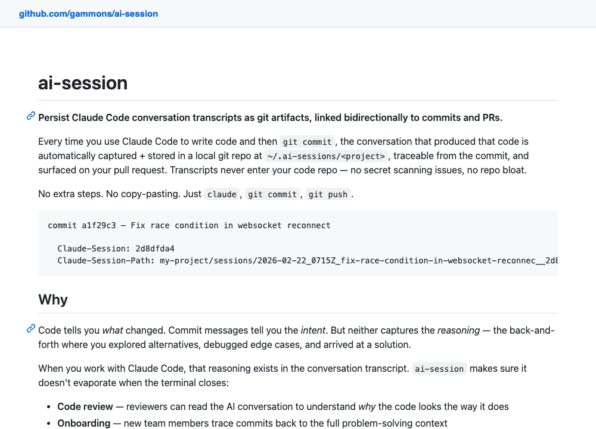
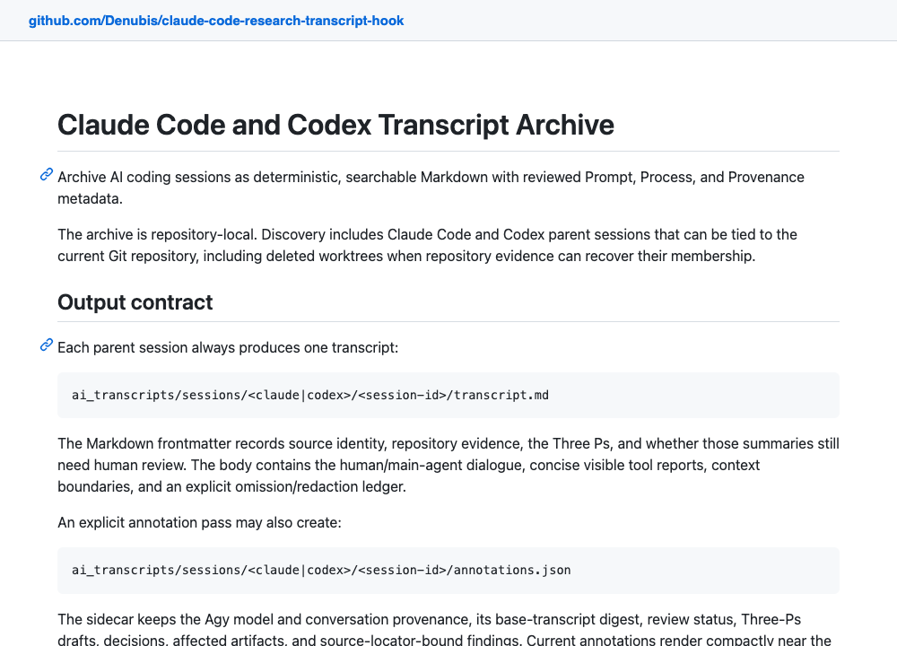
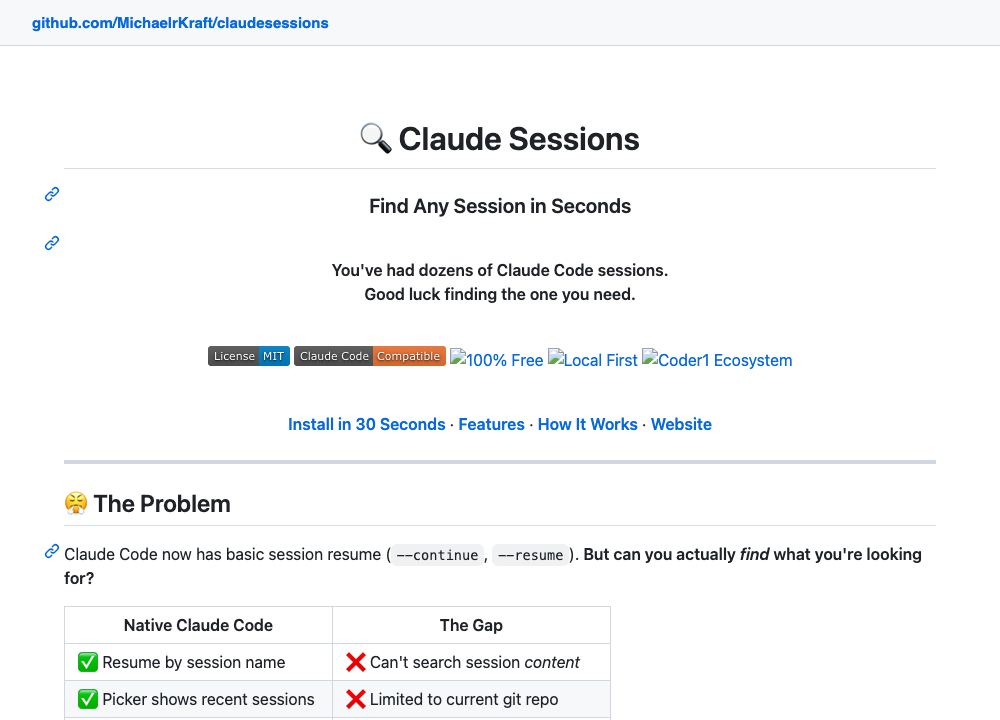
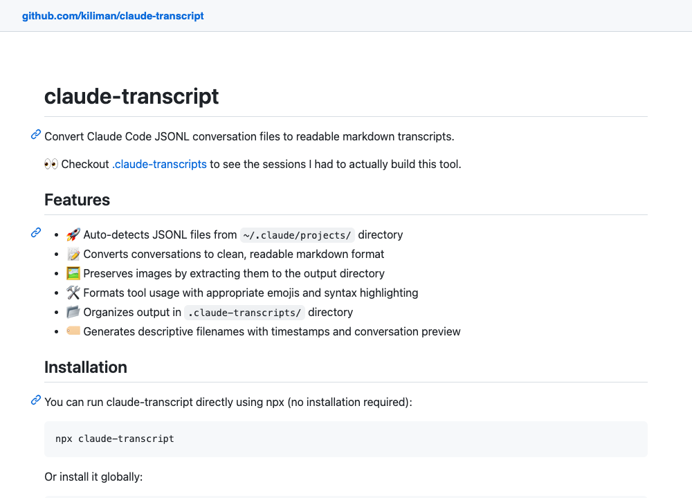
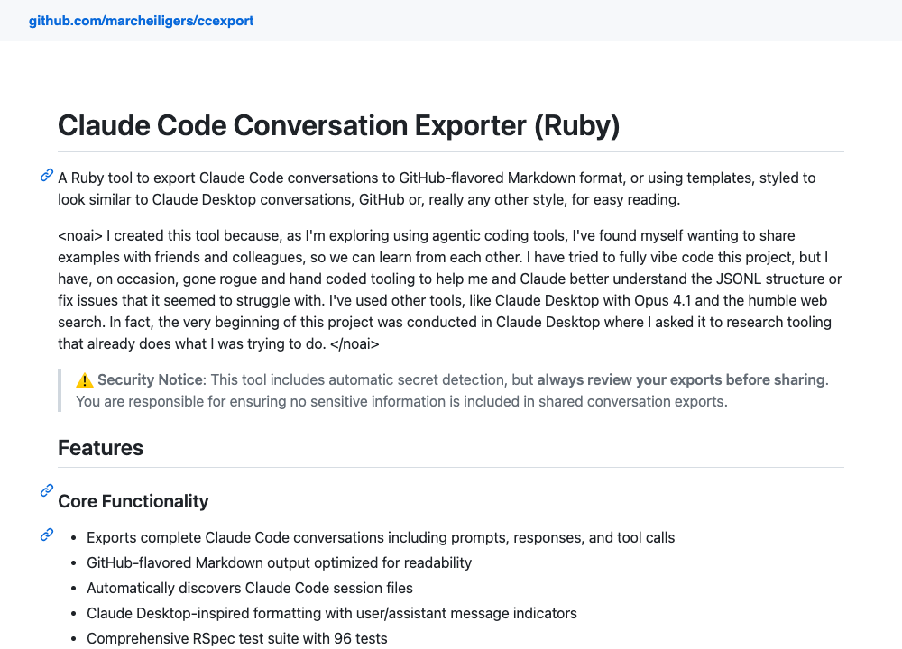
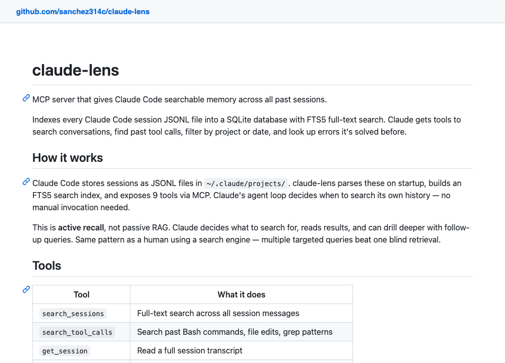
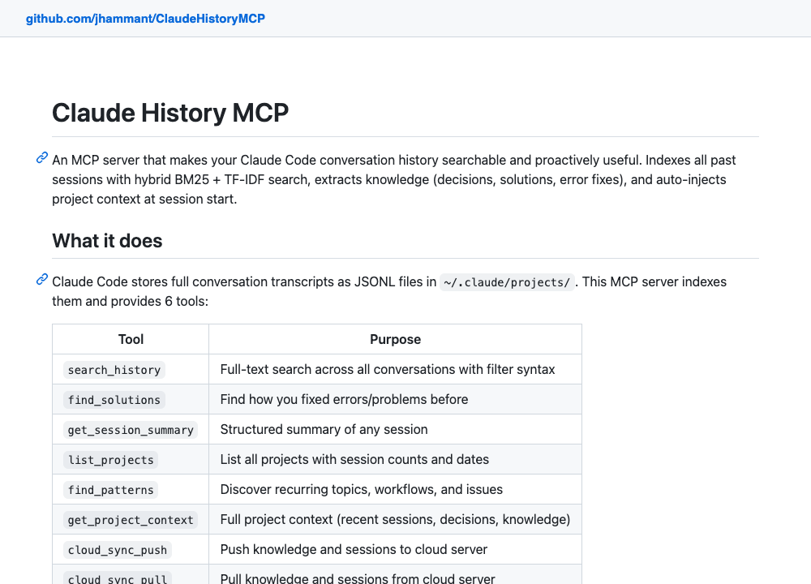
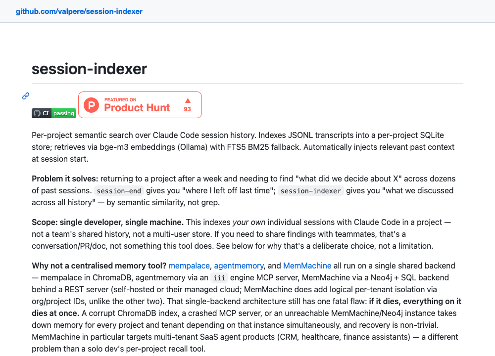

import Callout from "@components/mdx/Callout.astro"
import Link from "@components/mdx/Link.astro"


I type `/clear` several times a day. Each time, the session is effectively gone: the JSONL transcript sits under `~/.claude/projects/`, but I never look there.

What I wanted was exactly this: **every `/clear` automatically commits the conversation to a git repo.** Nothing to remember, nothing to run.

<p class="text-sm italic text-muted-foreground">Disclaimer: this post was co-written with an LLM.</p>

## The hook

There is no `PreClear` event, but `SessionEnd` fires on `/clear` with `reason: "clear"`, and the matcher can filter on it:

```json
{
  "hooks": {
    "SessionEnd": [
      {
        "matcher": "clear",
        "hooks": [
          {
            "type": "command",
            "command": "~/.claude/hooks/export-on-clear.sh",
            "timeout": 15
          }
        ]
      }
    ]
  }
}
```

`/export` can't be called from a hook (slash commands are interactive-only), so a small Python script renders the JSONL to text. It skips thinking blocks and subagent sidechains, clips tool output, and ignores records it can't parse, since the format is internal and changes between releases.

## Not making /clear wait

The foreground part only writes the file. Commit and push run detached, so a slow network never blocks `/clear`:

```bash
(
  cd "$REPO" 2>/dev/null || exit 0
  exec 9>"$REPO/.export.lock" 2>/dev/null || exit 0
  flock 9 2>/dev/null || :

  git add -A -- . >>"$LOG" 2>&1 || { log "git add failed"; exit 0; }
  # ... commit, then push with BatchMode and a connect timeout
) </dev/null >/dev/null 2>&1 &
disown 2>/dev/null || :
```

`flock` serialises concurrent clears across tmux panes. `BatchMode=yes` makes a missing SSH key fail fast; an unpushed commit goes out with the next export.

<Callout>
  Everything fails open: every error logs a line and exits 0. A broken archive
  that eats my `/clear` is worse than no archive.
</Callout>

Files are named `2026-09-18-140353-dotfiles-dfdb7f3f.txt`: timestamp, project, short session id. The repo is private, since transcripts can contain file contents and secrets.

```
2026-09-18 14:03:53 wrote 2026-09-18-140353-dotfiles-dfdb7f3f.txt (51667 bytes)
2026-09-18 14:03:53 pushed 2026-09-18-140353-dotfiles-dfdb7f3f.txt to origin/main
```

## Alternatives

None of these commit conversations on `/clear`. Most index or render transcripts in place, so they don't survive `rm -rf ~/.claude` or sync across machines.

**ai-session**<Link href="https://github.com/gammons/ai-session" />: stores transcripts as git artifacts linked to commits and PRs.



**claude-code-research-transcript-hook**<Link href="https://github.com/Denubis/claude-code-research-transcript-hook" />: archives sessions into the project as Markdown with research metadata. When I tried it, it couldn't find my transcript, crashed with `SameFileError`, and copied notes from unrelated projects into the archive.



**claudesessions**<Link href="https://github.com/MichaelrKraft/claudesessions" />: auto-archives sessions with full-text search and restore.



**claude-transcript**<Link href="https://github.com/kiliman/claude-transcript" />: converts JSONL transcripts to Markdown.



**ccexport**<Link href="https://github.com/marcheiligers/ccexport" />: Ruby gem that exports transcripts to Markdown and HTML.



**claude-lens**<Link href="https://github.com/sanchez314c/claude-lens" />: MCP server with a SQLite full-text index over past sessions.



**ClaudeHistoryMCP**<Link href="https://github.com/jhammant/ClaudeHistoryMCP" />: MCP server for searching conversation history.



**session-indexer**<Link href="https://github.com/valpere/session-indexer" />: local semantic search over sessions via Ollama embeddings.



## What's left

Search. `grep` over the exports goes far, but an index with a one-line summary per export would help. If I tire of that, I'll point claude-lens at the exports directory.

The scripts live in my dotfiles<Link href="https://github.com/Guernik/dotfiles" />.
